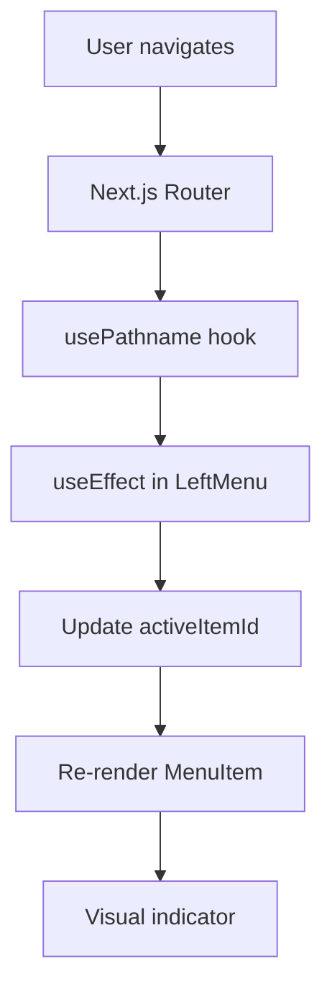
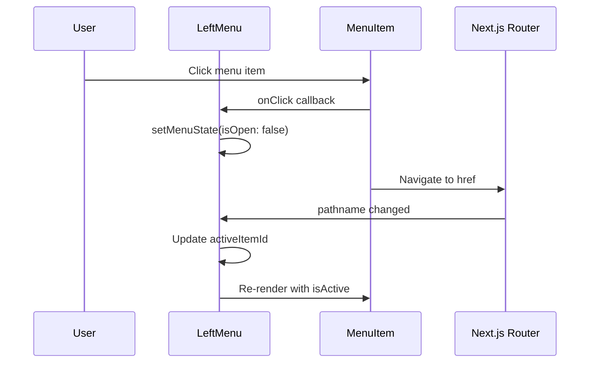
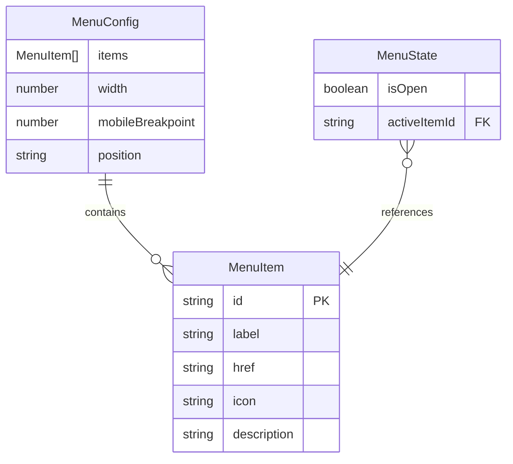

# Data Model: Menu de Navigation à Gauche

**Feature**: 001-left-menu  
**Date**: 2025-11-17  
**Phase**: 1 - Design & Contracts

## Overview

Ce document définit la structure des données pour le composant [`LeftMenu`](../../src/components/LeftMenu/LeftMenu.tsx). Le modèle de données est identique à celui du composant [`RightMenu`](../../src/components/RightMenu/RightMenu.tsx) existant, avec l'ajout de la valeur `'left'` pour la propriété `position`.

## Type Definitions

### MenuItem

Représente un élément individuel du menu de navigation.

```typescript
interface MenuItem {
  /** Identifiant unique de l'élément */
  id: string;
  
  /** Libellé affiché à l'utilisateur */
  label: string;
  
  /** Route de destination (Next.js route) */
  href: string;
  
  /** Icône optionnelle (emoji ou composant React) */
  icon?: string;
  
  /** Description pour l'accessibilité (aria-label) */
  description?: string;
}
```

**Contraintes**:
- `id`: Doit être unique dans la liste des items
- `label`: Chaîne non vide, max 50 caractères recommandé
- `href`: Route Next.js valide (commence par `/`)
- `icon`: Emoji Unicode ou composant React (future extension)
- `description`: Utilisé pour `aria-label`, recommandé pour accessibilité

**Exemple**:
```typescript
const homeItem: MenuItem = {
  id: 'home',
  label: 'Accueil',
  href: '/',
  icon: '🏠',
  description: 'Retour à la page d\'accueil'
};
```

### MenuConfig

Configuration globale du menu de navigation.

```typescript
interface MenuConfig {
  /** Liste des éléments du menu */
  items: MenuItem[];
  
  /** Largeur du menu en pixels (desktop) */
  width: number;
  
  /** Breakpoint mobile en pixels */
  mobileBreakpoint: number;
  
  /** Position du menu */
  position?: 'left' | 'right';
}
```

**Contraintes**:
- `items`: Tableau non vide, max 20 items recommandé
- `width`: Entre 200 et 400 pixels (recommandé: 280px)
- `mobileBreakpoint`: Généralement 768px (standard tablette)
- `position`: `'left'` pour menu gauche, `'right'` pour menu droit (défaut: `'right'`)

**Exemple**:
```typescript
const menuConfig: MenuConfig = {
  items: [
    { id: 'home', label: 'Accueil', href: '/' },
    { id: 'drilling', label: 'Perçage', href: '/drilling' },
    { id: 'cutting', label: 'Découpe', href: '/cutting' },
  ],
  width: 280,
  mobileBreakpoint: 768,
  position: 'left'  // ← Nouvelle valeur pour menu gauche
};
```

### MenuState

État interne du composant menu (géré par React state).

```typescript
interface MenuState {
  /** Menu ouvert ou fermé (mobile uniquement) */
  isOpen: boolean;
  
  /** ID de l'élément actuellement actif */
  activeItemId: string | null;
}
```

**Contraintes**:
- `isOpen`: `true` = menu visible sur mobile, `false` = menu caché
- `activeItemId`: Doit correspondre à un `id` dans `items`, ou `null` si aucun actif

**Comportement**:
- Desktop (>768px): `isOpen` ignoré, menu toujours visible
- Mobile (≤768px): `isOpen` contrôle la visibilité
- `activeItemId` déterminé automatiquement via `usePathname()`

**Exemple**:
```typescript
const [menuState, setMenuState] = useState<MenuState>({
  isOpen: false,
  activeItemId: 'home'
});
```

## Data Flow

### Component Hierarchy

```
RootLayout (layout.tsx)
  │
  ├─ menuConfig: MenuConfig
  │
  └─ LeftMenu
       │
       ├─ menuState: MenuState (internal)
       │
       └─ MenuItem (x5)
            │
            └─ item: MenuItem
```

### State Management



### Event Flow



## Data Validation

### Runtime Validation

**Recommandations** (non implémenté actuellement):

```typescript
function validateMenuConfig(config: MenuConfig): void {
  // Valider items
  if (!config.items || config.items.length === 0) {
    throw new Error('MenuConfig.items cannot be empty');
  }
  
  // Valider unicité des IDs
  const ids = config.items.map(item => item.id);
  const uniqueIds = new Set(ids);
  if (ids.length !== uniqueIds.size) {
    throw new Error('MenuConfig.items must have unique IDs');
  }
  
  // Valider width
  if (config.width < 200 || config.width > 400) {
    console.warn('MenuConfig.width should be between 200 and 400px');
  }
  
  // Valider position
  if (config.position && !['left', 'right'].includes(config.position)) {
    throw new Error('MenuConfig.position must be "left" or "right"');
  }
}
```

### TypeScript Validation

**Compile-time checks** via TypeScript strict mode:

```typescript
// ✅ Valid
const config: MenuConfig = {
  items: [{ id: 'home', label: 'Accueil', href: '/' }],
  width: 280,
  mobileBreakpoint: 768,
  position: 'left'
};

// ❌ Type error: position must be 'left' | 'right'
const invalid: MenuConfig = {
  items: [],
  width: 280,
  mobileBreakpoint: 768,
  position: 'top'  // Error!
};
```

## Data Persistence

### Storage Strategy

**Aucune persistence nécessaire** pour cette feature:
- ✅ Configuration statique dans [`layout.tsx`](../../src/app/layout.tsx)
- ✅ État du menu (`isOpen`, `activeItemId`) géré en mémoire
- ✅ Pas de localStorage/sessionStorage requis
- ✅ Pas de backend/API requis

**Justification**:
- Menu de navigation statique (pas de personnalisation utilisateur)
- État éphémère (réinitialisé à chaque chargement de page)
- Performance optimale (pas d'I/O)

### Future Considerations

**Si personnalisation utilisateur requise** (non planifié):
- Stocker préférences dans `localStorage`
- Exemple: ordre des items, items favoris, menu réduit/étendu
- Nécessiterait ajout de logique de persistence

## Data Transformations

### Input → Internal State

```typescript
// Configuration externe (layout.tsx)
const menuConfig: MenuConfig = {
  items: [...],
  width: 280,
  mobileBreakpoint: 768,
  position: 'left'
};

// État interne (LeftMenu component)
const [menuState, setMenuState] = useState<MenuState>({
  isOpen: false,
  activeItemId: null
});

// Transformation: pathname → activeItemId
useEffect(() => {
  const activeItem = config.items.find(item => item.href === pathname);
  setMenuState(prev => ({
    ...prev,
    activeItemId: activeItem?.id || null
  }));
}, [pathname, config.items]);
```

### State → Visual Representation

```typescript
// État interne
menuState = {
  isOpen: true,
  activeItemId: 'drilling'
};

// Transformation CSS
<nav style={{
  transform: menuState.isOpen ? 'translateX(0)' : 'translateX(-100%)'
}}>
  {config.items.map(item => (
    <MenuItem
      key={item.id}
      item={item}
      isActive={menuState.activeItemId === item.id}  // ← Transformation
    />
  ))}
</nav>
```

## Data Relationships

### Entity Relationship Diagram



### Relationships

1. **MenuConfig → MenuItem**: One-to-Many
   - Un `MenuConfig` contient plusieurs `MenuItem`
   - Relation de composition (items appartiennent au config)

2. **MenuState → MenuItem**: Many-to-One (optional)
   - `MenuState.activeItemId` référence un `MenuItem.id`
   - Relation optionnelle (peut être `null`)

3. **LeftMenu → MenuConfig**: One-to-One
   - Un composant `LeftMenu` reçoit un `MenuConfig` via props
   - Relation immutable (config ne change pas après mount)

## Data Constraints

### Business Rules

1. **Unicité des IDs**
   - Chaque `MenuItem.id` doit être unique dans `MenuConfig.items`
   - Violation → comportement indéfini (plusieurs items actifs)

2. **Routes valides**
   - Chaque `MenuItem.href` doit être une route Next.js valide
   - Violation → erreur 404 au clic

3. **Largeur raisonnable**
   - `MenuConfig.width` entre 200-400px recommandé
   - Violation → UX dégradée (menu trop étroit/large)

4. **Breakpoint cohérent**
   - `MenuConfig.mobileBreakpoint` généralement 768px
   - Violation → comportement responsive incohérent

### Technical Constraints

1. **TypeScript strict mode**
   - Tous les types doivent être explicites
   - Pas de `any` autorisé

2. **Immutabilité**
   - `MenuConfig` ne doit pas être muté après création
   - Utiliser spread operator pour updates: `{ ...config, width: 300 }`

3. **Performance**
   - Max 20 items recommandé (au-delà, considérer virtualisation)
   - Pas de re-render inutiles (utiliser `React.memo` si nécessaire)

## Examples

### Complete Configuration

```typescript
import { MenuConfig } from '@/components/LeftMenu/types';

const menuConfig: MenuConfig = {
  items: [
    {
      id: 'home',
      label: 'Accueil',
      href: '/',
      icon: '🏠',
      description: 'Retour à la page d\'accueil'
    },
    {
      id: 'drilling',
      label: 'Gabarits de perçage',
      href: '/drilling',
      icon: '🔨',
      description: 'Créer des gabarits de perçage personnalisés'
    },
    {
      id: 'cutting',
      label: 'Guides de coupe',
      href: '/cutting',
      icon: '✂️',
      description: 'Générer des guides de coupe précis'
    },
    {
      id: 'accessories',
      label: 'Accessoires d\'atelier',
      href: '/accessories',
      icon: '🔧',
      description: 'Outils et accessoires divers'
    },
    {
      id: 'creations',
      label: 'Mes créations',
      href: '/creations',
      icon: '📁',
      description: 'Gérer vos créations sauvegardées'
    }
  ],
  width: 280,
  mobileBreakpoint: 768,
  position: 'left'
};

export default menuConfig;
```

### Dynamic Configuration

```typescript
// Configuration générée dynamiquement (exemple avancé)
function generateMenuConfig(userRole: string): MenuConfig {
  const baseItems: MenuItem[] = [
    { id: 'home', label: 'Accueil', href: '/' }
  ];
  
  const adminItems: MenuItem[] = [
    { id: 'admin', label: 'Administration', href: '/admin' }
  ];
  
  return {
    items: userRole === 'admin' 
      ? [...baseItems, ...adminItems]
      : baseItems,
    width: 280,
    mobileBreakpoint: 768,
    position: 'left'
  };
}
```

### State Updates

```typescript
// Toggle menu (mobile)
const handleToggle = () => {
  setMenuState(prev => ({
    ...prev,
    isOpen: !prev.isOpen
  }));
};

// Close menu (mobile)
const handleClose = () => {
  setMenuState(prev => ({
    ...prev,
    isOpen: false
  }));
};

// Update active item (automatic)
useEffect(() => {
  const activeItem = config.items.find(item => item.href === pathname);
  setMenuState(prev => ({
    ...prev,
    activeItemId: activeItem?.id || null
  }));
}, [pathname, config.items]);
```

## Migration Notes

### From RightMenu to LeftMenu

**Changements de données**: Aucun

**Seul changement**: Valeur de `position`

```typescript
// Avant (RightMenu)
const menuConfig: MenuConfig = {
  items: [...],
  width: 280,
  mobileBreakpoint: 768,
  position: 'right'  // ← Ancienne valeur
};

// Après (LeftMenu)
const menuConfig: MenuConfig = {
  items: [...],
  width: 280,
  mobileBreakpoint: 768,
  position: 'left'   // ← Nouvelle valeur
};
```

**Compatibilité**: Les types sont 100% compatibles, seule la valeur change.

## Conclusion

Le modèle de données pour [`LeftMenu`](../../src/components/LeftMenu/LeftMenu.tsx) est simple, bien typé et identique à [`RightMenu`](../../src/components/RightMenu/RightMenu.tsx). La seule différence est la valeur `'left'` pour `position`, qui influence le rendu CSS mais pas la structure des données.

**Points clés**:
- ✅ Types TypeScript stricts
- ✅ Pas de persistence requise
- ✅ État géré en mémoire
- ✅ Configuration statique
- ✅ Migration triviale (changement de valeur uniquement)

---

**Document validé par**: [À compléter]  
**Date de validation**: [À compléter]