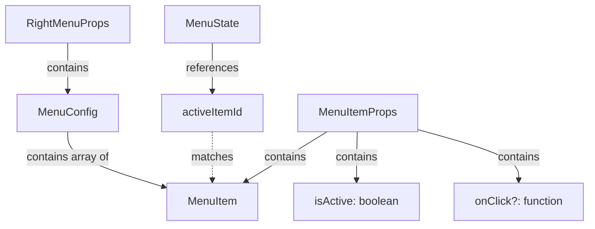

# Contracts: Interfaces TypeScript

**Phase**: 1 - Design & Contracts  
**Date**: 2025-01-17  
**Status**: Completed

## Vue d'Ensemble

Ce document définit tous les contrats TypeScript (interfaces) nécessaires pour l'implémentation du menu de navigation latéral droit. Ces interfaces garantissent la type-safety et servent de documentation pour les développeurs.

## Fichier: `src/components/RightMenu/types.ts`

Ce fichier unique contient toutes les interfaces nécessaires pour le menu.

### Interface: MenuItem

Représente un élément individuel du menu de navigation.

```typescript
/**
 * Représente un élément du menu de navigation
 */
export interface MenuItem {
  /**
   * Identifiant unique de l'item
   * Utilisé pour la gestion de l'état actif et les clés React
   * @example 'drilling', 'cutting', 'accessories'
   */
  id: string;
  
  /**
   * Libellé affiché dans le menu
   * Doit être court et descriptif (max 30 caractères recommandé)
   * @example 'Gabarits de perçage', 'Guides de coupe'
   */
  label: string;
  
  /**
   * URL de destination (route Next.js)
   * Doit commencer par '/' pour les routes internes
   * @example '/drilling', '/cutting', '/accessories'
   */
  href: string;
  
  /**
   * Icône optionnelle (emoji ou nom d'icône)
   * Phase 1: Non implémenté (réservé pour future itération)
   * @example '🔨', 'drill-icon'
   */
  icon?: string;
  
  /**
   * Description optionnelle pour l'accessibilité
   * Utilisée dans aria-label si fournie
   * @example 'Créer des gabarits de perçage personnalisés'
   */
  description?: string;
}
```

**Validation**:
- `id` : Requis, non vide, unique dans la collection
- `label` : Requis, non vide, max 30 caractères
- `href` : Requis, doit commencer par '/'
- `icon` : Optionnel
- `description` : Optionnel

**Exemple d'utilisation**:
```typescript
const drillingItem: MenuItem = {
  id: 'drilling',
  label: 'Gabarits de perçage',
  href: '/drilling',
  description: 'Créer des gabarits de perçage personnalisés',
};
```

---

### Interface: MenuConfig

Configuration globale du menu.

```typescript
/**
 * Configuration du menu de navigation
 */
export interface MenuConfig {
  /**
   * Liste des items de menu à afficher
   * L'ordre dans le tableau détermine l'ordre d'affichage
   * @example [drillingItem, cuttingItem, accessoriesItem]
   */
  items: MenuItem[];
  
  /**
   * Largeur du menu en pixels (desktop uniquement)
   * Valeur fixe pour cohérence visuelle
   * @default 280
   */
  width: number;
  
  /**
   * Breakpoint en pixels pour basculer mobile/desktop
   * Mobile: < mobileBreakpoint
   * Desktop: >= mobileBreakpoint
   * @default 768
   */
  mobileBreakpoint: number;
  
  /**
   * Position du menu (pour extensibilité future)
   * Phase 1: Toujours 'right'
   * @default 'right'
   */
  position?: 'left' | 'right';
}
```

**Validation**:
- `items` : Requis, non vide, tous les items doivent être valides
- `width` : Requis, > 0
- `mobileBreakpoint` : Requis, > 0
- `position` : Optionnel, 'left' ou 'right'

**Exemple d'utilisation**:
```typescript
const menuConfig: MenuConfig = {
  items: [
    { id: 'drilling', label: 'Gabarits de perçage', href: '/drilling' },
    { id: 'cutting', label: 'Guides de coupe', href: '/cutting' },
    { id: 'accessories', label: 'Accessoires d\'atelier', href: '/accessories' },
    { id: 'creations', label: 'Mes créations', href: '/creations' },
  ],
  width: 280,
  mobileBreakpoint: 768,
  position: 'right',
};
```

---

### Interface: MenuState

État interne du menu (géré par React useState).

```typescript
/**
 * État interne du menu
 */
export interface MenuState {
  /**
   * Indique si le menu mobile est ouvert
   * Desktop: Toujours undefined (menu toujours visible)
   * Mobile: true = ouvert, false = fermé
   * @default false
   */
  isOpen: boolean;
  
  /**
   * ID de l'item actuellement actif (page courante)
   * Déterminé automatiquement via usePathname()
   * null si aucune correspondance trouvée
   * @example 'drilling', 'cutting', null
   */
  activeItemId: string | null;
}
```

**Validation**:
- `isOpen` : Requis, boolean
- `activeItemId` : Requis, string ou null

**Exemple d'utilisation**:
```typescript
const [menuState, setMenuState] = useState<MenuState>({
  isOpen: false,
  activeItemId: null,
});

// Ouvrir le menu mobile
setMenuState(prev => ({ ...prev, isOpen: true }));

// Définir l'item actif
setMenuState(prev => ({ ...prev, activeItemId: 'drilling' }));
```

---

### Interface: RightMenuProps

Props du composant RightMenu.

```typescript
/**
 * Props du composant RightMenu
 */
export interface RightMenuProps {
  /**
   * Configuration du menu
   * Contient les items, dimensions et comportement
   */
  config: MenuConfig;
}
```

**Validation**:
- `config` : Requis, doit être un MenuConfig valide

**Exemple d'utilisation**:
```typescript
export default function RightMenu({ config }: RightMenuProps) {
  // Implémentation du composant
}

// Utilisation
<RightMenu config={menuConfig} />
```

---

### Interface: MenuItemProps

Props du composant MenuItem.

```typescript
/**
 * Props du composant MenuItem
 */
export interface MenuItemProps {
  /**
   * Données de l'item de menu
   * Contient id, label, href, etc.
   */
  item: MenuItem;
  
  /**
   * Indique si cet item est actuellement actif
   * Utilisé pour appliquer les styles actifs
   * @example true si on est sur la page /drilling et item.href === '/drilling'
   */
  isActive: boolean;
  
  /**
   * Callback optionnel appelé au clic sur l'item
   * Utilisé pour fermer le menu mobile après navigation
   * @example () => setMenuState(prev => ({ ...prev, isOpen: false }))
   */
  onClick?: () => void;
}
```

**Validation**:
- `item` : Requis, doit être un MenuItem valide
- `isActive` : Requis, boolean
- `onClick` : Optionnel, fonction

**Exemple d'utilisation**:
```typescript
export default function MenuItem({ item, isActive, onClick }: MenuItemProps) {
  return (
    <Link href={item.href} onClick={onClick}>
      {item.label}
    </Link>
  );
}

// Utilisation
<MenuItem
  item={drillingItem}
  isActive={activeItemId === 'drilling'}
  onClick={() => handleItemClick()}
/>
```

---

## Fichier Complet: `types.ts`

Voici le fichier complet à créer dans `src/components/RightMenu/types.ts`:

```typescript
/**
 * Types et interfaces pour le menu de navigation latéral droit
 * @module RightMenu/types
 */

/**
 * Représente un élément du menu de navigation
 */
export interface MenuItem {
  /** Identifiant unique */
  id: string;
  /** Libellé affiché */
  label: string;
  /** Route de destination */
  href: string;
  /** Icône optionnelle (future) */
  icon?: string;
  /** Description pour accessibilité */
  description?: string;
}

/**
 * Configuration du menu de navigation
 */
export interface MenuConfig {
  /** Liste des items */
  items: MenuItem[];
  /** Largeur en pixels (desktop) */
  width: number;
  /** Breakpoint mobile en pixels */
  mobileBreakpoint: number;
  /** Position du menu */
  position?: 'left' | 'right';
}

/**
 * État interne du menu
 */
export interface MenuState {
  /** Menu ouvert (mobile uniquement) */
  isOpen: boolean;
  /** ID de l'item actif */
  activeItemId: string | null;
}

/**
 * Props du composant RightMenu
 */
export interface RightMenuProps {
  /** Configuration du menu */
  config: MenuConfig;
}

/**
 * Props du composant MenuItem
 */
export interface MenuItemProps {
  /** Données de l'item */
  item: MenuItem;
  /** Item actuellement actif */
  isActive: boolean;
  /** Callback au clic */
  onClick?: () => void;
}
```

## Diagramme de Relations



## Utilisation dans les Composants

### Dans RightMenu.tsx

```typescript
import { RightMenuProps, MenuState, MenuItem } from './types';

export default function RightMenu({ config }: RightMenuProps) {
  const [menuState, setMenuState] = useState<MenuState>({
    isOpen: false,
    activeItemId: null,
  });
  
  // Utilisation de config.items, config.width, etc.
}
```

### Dans MenuItem.tsx

```typescript
import { MenuItemProps } from './types';

export default function MenuItem({ item, isActive, onClick }: MenuItemProps) {
  // Utilisation de item.label, item.href, isActive, onClick
}
```

### Dans layout.tsx

```typescript
import { MenuConfig } from '@/components/RightMenu/types';

const menuConfig: MenuConfig = {
  items: [...],
  width: 280,
  mobileBreakpoint: 768,
};
```

## Validation Runtime (Optionnel)

Pour une validation runtime stricte, vous pouvez ajouter ces fonctions dans un fichier `validation.ts`:

```typescript
import { MenuItem, MenuConfig } from './types';

export function validateMenuItem(item: MenuItem): boolean {
  if (!item.id || item.id.trim() === '') {
    console.error('MenuItem.id is required');
    return false;
  }
  
  if (!item.label || item.label.trim() === '') {
    console.error('MenuItem.label is required');
    return false;
  }
  
  if (item.label.length > 30) {
    console.warn(`MenuItem.label too long: ${item.label}`);
  }
  
  if (!item.href || !item.href.startsWith('/')) {
    console.error('MenuItem.href must start with /');
    return false;
  }
  
  return true;
}

export function validateMenuConfig(config: MenuConfig): boolean {
  if (!config.items || config.items.length === 0) {
    console.error('MenuConfig.items cannot be empty');
    return false;
  }
  
  if (!config.items.every(validateMenuItem)) {
    return false;
  }
  
  const ids = config.items.map(item => item.id);
  const uniqueIds = new Set(ids);
  if (ids.length !== uniqueIds.size) {
    console.error('MenuItem.id must be unique');
    return false;
  }
  
  if (config.width <= 0) {
    console.error('MenuConfig.width must be positive');
    return false;
  }
  
  if (config.mobileBreakpoint <= 0) {
    console.error('MenuConfig.mobileBreakpoint must be positive');
    return false;
  }
  
  return true;
}
```

## Tests TypeScript

Pour vérifier que les types sont corrects, vous pouvez créer des tests de type:

```typescript
import { MenuItem, MenuConfig, MenuState, RightMenuProps, MenuItemProps } from './types';

// Test: MenuItem valide
const validMenuItem: MenuItem = {
  id: 'test',
  label: 'Test',
  href: '/test',
};

// Test: MenuConfig valide
const validConfig: MenuConfig = {
  items: [validMenuItem],
  width: 280,
  mobileBreakpoint: 768,
};

// Test: MenuState valide
const validState: MenuState = {
  isOpen: false,
  activeItemId: null,
};

// Test: RightMenuProps valide
const validRightMenuProps: RightMenuProps = {
  config: validConfig,
};

// Test: MenuItemProps valide
const validMenuItemProps: MenuItemProps = {
  item: validMenuItem,
  isActive: true,
  onClick: () => console.log('clicked'),
};

// Ces déclarations ne devraient pas produire d'erreurs TypeScript
```

## Checklist de Validation

- [x] Toutes les interfaces sont définies
- [x] Tous les champs requis sont marqués comme tels
- [x] Tous les champs optionnels ont le suffixe `?`
- [x] Les types sont documentés avec JSDoc
- [x] Les exemples d'utilisation sont fournis
- [x] Les validations sont documentées
- [x] Le diagramme de relations est clair
- [x] Les tests de type sont fournis

## Prochaines Étapes

1. ✅ **Contrats définis** : Toutes les interfaces TypeScript sont documentées
2. ➡️ **Implémentation** : Utiliser ces contrats pour implémenter les composants
3. ➡️ **Tests** : Créer des tests unitaires basés sur ces interfaces
4. ➡️ **Documentation** : Générer la documentation API avec TypeDoc (optionnel)

**Note**: Ces contrats sont la source de vérité pour l'implémentation. Toute modification doit être documentée ici en premier.