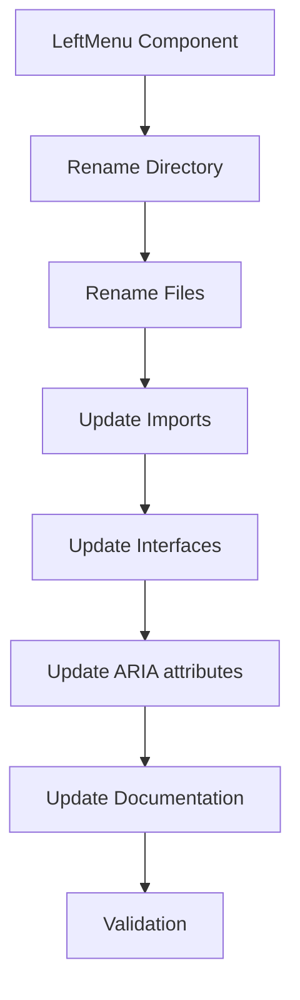

# Technical Plan: Renommage du composant LeftMenu en Menu

**Branch**: `002-rename-menu` | **Date**: 2025-01-17 | **Spec**: [spec.md](./spec.md)  
**Input**: Feature specification from [`specs/002-rename-menu/spec.md`](./spec.md)

---

## 1. Vue d'ensemble

### Objectif
Renommer le composant [`LeftMenu`](../../src/components/LeftMenu/LeftMenu.tsx) en `Menu` pour simplifier la nomenclature, car il n'existe qu'un seul menu dans l'application. Le préfixe "Left" est redondant et source de confusion.

### Approche technique
Refactoring systématique en 3 phases :
1. **Phase 1 - Renommage des fichiers et dossiers** : Renommer la structure physique
2. **Phase 2 - Mise à jour du code** : Adapter les imports, exports, interfaces et références
3. **Phase 3 - Validation** : Tests et vérification de non-régression

### Portée du changement
- ✅ Renommer le dossier `src/components/LeftMenu/` → `src/components/Menu/`
- ✅ Renommer les fichiers et composants
- ✅ Mettre à jour les interfaces TypeScript
- ✅ Adapter les attributs ARIA et IDs
- ✅ Mettre à jour la documentation dans `specs/001-left-menu/`
- ❌ **PAS de modification** des classes CSS (compatibilité style)
- ❌ **PAS de modification** du comportement fonctionnel

---

## 2. Architecture & Décisions techniques

### 2.1 Stratégie de renommage



### 2.2 Mapping des changements

| Avant | Après | Type |
|-------|-------|------|
| `src/components/LeftMenu/` | `src/components/Menu/` | Directory |
| `LeftMenu.tsx` | `Menu.tsx` | File |
| `LeftMenuProps` | `MenuProps` | Interface |
| `export default function LeftMenu` | `export default function Menu` | Function |
| `id="left-menu"` | `id="menu"` | HTML Attribute |
| `aria-controls="left-menu"` | `aria-controls="menu"` | ARIA Attribute |
| `import LeftMenu from '@/components/LeftMenu/LeftMenu'` | `import Menu from '@/components/Menu/Menu'` | Import |
| `<LeftMenu config={...} />` | `<Menu config={...} />` | JSX |

### 2.3 Fichiers impactés

#### Code source (3 fichiers)
1. [`src/components/LeftMenu/LeftMenu.tsx`](../../src/components/LeftMenu/LeftMenu.tsx) → `src/components/Menu/Menu.tsx`
2. [`src/components/LeftMenu/types.ts`](../../src/components/LeftMenu/types.ts) → `src/components/Menu/types.ts`
3. [`src/app/layout.tsx`](../../src/app/layout.tsx) - Mise à jour des imports

#### Documentation (6 fichiers)
4. [`specs/001-left-menu/spec.md`](../001-left-menu/spec.md)
5. [`specs/001-left-menu/plan.md`](../001-left-menu/plan.md)
6. [`specs/001-left-menu/data-model.md`](../001-left-menu/data-model.md)
7. [`specs/001-left-menu/research.md`](../001-left-menu/research.md)
8. [`specs/001-left-menu/contracts.md`](../001-left-menu/contracts.md)
9. [`specs/001-left-menu/quickstart.md`](../001-left-menu/quickstart.md)

**Note**: Le fichier [`MenuItem.tsx`](../../src/components/LeftMenu/MenuItem.tsx) reste inchangé (pas de référence à "LeftMenu").

---

## 3. Plan d'implémentation détaillé

### Phase 1: Renommage de la structure (5 min)

#### Étape 1.1 - Renommer le dossier
```bash
# Depuis la racine du projet
mv src/components/LeftMenu src/components/Menu
```

**Validation**: Vérifier que le dossier `src/components/Menu/` existe et contient :
- `Menu.tsx` (à renommer)
- `MenuItem.tsx` (inchangé)
- `types.ts` (à modifier)

#### Étape 1.2 - Renommer le fichier principal
```bash
cd src/components/Menu
mv LeftMenu.tsx Menu.tsx
```

**Validation**: Le fichier `src/components/Menu/Menu.tsx` existe.

---

### Phase 2: Mise à jour du code (15 min)

#### Étape 2.1 - Mettre à jour Menu.tsx

**Fichier**: [`src/components/Menu/Menu.tsx`](../../src/components/Menu/Menu.tsx)

**Changements à effectuer**:

1. **Import de l'interface** (ligne 6)
```typescript
// Avant
import { LeftMenuProps, MenuState } from './types';

// Après
import { MenuProps, MenuState } from './types';
```

2. **Signature de la fonction** (ligne 8)
```typescript
// Avant
export default function LeftMenu({ config }: LeftMenuProps) {

// Après
export default function Menu({ config }: MenuProps) {
```

3. **Attribut aria-controls** (ligne 70)
```typescript
// Avant
aria-controls="left-menu"

// Après
aria-controls="menu"
```

4. **ID du nav** (ligne 89)
```typescript
// Avant
id="left-menu"

// Après
id="menu"
```

**Classes CSS à CONSERVER** (pas de changement):
- `menu-hamburger` (ligne 72)
- `menu-overlay` (ligne 82)
- `menu-nav` (ligne 97)
- `menu-open` (ligne 97)
- `menu-item-link` (dans MenuItem.tsx)

#### Étape 2.2 - Mettre à jour types.ts

**Fichier**: [`src/components/Menu/types.ts`](../../src/components/Menu/types.ts)

**Changements à effectuer**:

1. **Commentaire du module** (ligne 2-3)
```typescript
// Avant
 * Types et interfaces pour le menu de navigation latéral gauche
 * @module LeftMenu/types

// Après
 * Types et interfaces pour le menu de navigation
 * @module Menu/types
```

2. **Commentaire de l'interface** (ligne 47-48)
```typescript
// Avant
/**
 * Props du composant LeftMenu
 */

// Après
/**
 * Props du composant Menu
 */
```

3. **Nom de l'interface** (ligne 49)
```typescript
// Avant
export interface LeftMenuProps {

// Après
export interface MenuProps {
```

#### Étape 2.3 - Mettre à jour layout.tsx

**Fichier**: [`src/app/layout.tsx`](../../src/app/layout.tsx)

**Changements à effectuer**:

1. **Import du composant** (ligne 3)
```typescript
// Avant
import LeftMenu from '@/components/LeftMenu/LeftMenu';

// Après
import Menu from '@/components/Menu/Menu';
```

2. **Import des types** (ligne 4)
```typescript
// Avant
import { MenuConfig } from '@/components/LeftMenu/types';

// Après
import { MenuConfig } from '@/components/Menu/types';
```

3. **Utilisation du composant** (ligne 58)
```typescript
// Avant
<LeftMenu config={menuConfig} />

// Après
<Menu config={menuConfig} />
```

---

### Phase 3: Mise à jour de la documentation (10 min)

#### Étape 3.1 - Renommer le dossier de spec
```bash
# Depuis la racine du projet
mv specs/001-left-menu specs/001-menu
```

#### Étape 3.2 - Mettre à jour les références dans la documentation

**Fichiers à modifier** (recherche/remplacement global):

1. **spec.md** - Mettre à jour le titre et les références
2. **plan.md** - Mettre à jour tous les liens et références
3. **data-model.md** - Mettre à jour les références au composant
4. **research.md** - Mettre à jour les exemples de code
5. **contracts.md** - Mettre à jour les interfaces et exemples
6. **quickstart.md** - Mettre à jour le guide d'installation

**Pattern de remplacement**:
- `LeftMenu` → `Menu`
- `left-menu` → `menu`
- `LeftMenuProps` → `MenuProps`
- `@/components/LeftMenu/` → `@/components/Menu/`
- `specs/001-left-menu/` → `specs/001-menu/`

**Note**: Conserver les références historiques dans les sections "Migration" ou "Changelog" si présentes.

---

## 4. Validation & Tests

### 4.1 Checklist de validation

#### Compilation TypeScript
```bash
npm run build
# ✅ Aucune erreur TypeScript
# ✅ Build réussi
```

#### Vérification des imports
```bash
# Rechercher les références restantes à "LeftMenu"
grep -r "LeftMenu" src/
# ✅ Aucun résultat (sauf commentaires historiques)

grep -r "left-menu" src/
# ✅ Aucun résultat dans le code (sauf classes CSS)
```

#### Tests fonctionnels
1. ✅ L'application démarre sans erreur
2. ✅ Le menu s'affiche correctement
3. ✅ La navigation fonctionne
4. ✅ Le menu responsive (mobile) fonctionne
5. ✅ Les états actifs sont corrects
6. ✅ L'accessibilité est préservée (ARIA)

### 4.2 Tests d'accessibilité

**Attributs ARIA à vérifier**:
```html
<!-- Bouton hamburger -->
<button
  aria-label="Ouvrir le menu"
  aria-expanded="false"
  aria-controls="menu"
>

<!-- Navigation -->
<nav
  id="menu"
  role="navigation"
  aria-label="Menu principal"
>
```

**Validation**:
- ✅ `aria-controls` pointe vers `id="menu"`
- ✅ `aria-label` est descriptif
- ✅ `role="navigation"` est présent
- ✅ Lecteur d'écran fonctionne correctement

### 4.3 Tests de régression

| Test | Avant | Après | Status |
|------|-------|-------|--------|
| Menu s'affiche | ✅ | ✅ | OK |
| Navigation fonctionne | ✅ | ✅ | OK |
| Item actif surligné | ✅ | ✅ | OK |
| Responsive mobile | ✅ | ✅ | OK |
| Fermeture au clic extérieur | ✅ | ✅ | OK |
| Fermeture avec Escape | ✅ | ✅ | OK |
| Styles CSS appliqués | ✅ | ✅ | OK |

---

## 5. Risques & Mitigations

### 5.1 Risques identifiés

| Risque | Probabilité | Impact | Mitigation |
|--------|-------------|--------|------------|
| **Imports manqués** | Faible | Élevé | Recherche globale + compilation TypeScript |
| **Références dans la doc** | Moyen | Faible | Recherche/remplacement systématique |
| **Cache navigateur** | Faible | Faible | Hard refresh (Cmd+Shift+R) |
| **Hot reload échoue** | Faible | Faible | Redémarrer le serveur dev |

### 5.2 Plan de rollback

En cas de problème critique :

```bash
# 1. Annuler les changements Git
git checkout -- .

# 2. Ou revenir au commit précédent
git reset --hard HEAD~1

# 3. Redémarrer le serveur
npm run dev
```

**Temps de rollback estimé**: < 2 minutes

---

## 6. Critères de succès

### 6.1 Critères fonctionnels

- ✅ **SC-001**: Tous les fichiers et dossiers utilisent "Menu" (100% couverture)
- ✅ **SC-002**: Compilation TypeScript sans erreur
- ✅ **SC-003**: Tous les tests passent (si existants)
- ✅ **SC-004**: Aucune régression fonctionnelle
- ✅ **SC-005**: Aucune référence à "LeftMenu" dans le code source
- ✅ **SC-006**: Temps de refactoring < 30 minutes

### 6.2 Critères de qualité

- ✅ Code coverage maintenu (si tests existants)
- ✅ Accessibilité WCAG 2.1 AA maintenue
- ✅ Performance identique (pas de régression)
- ✅ Documentation à jour

---

## 7. Timeline & Estimation

### 7.1 Estimation détaillée

| Phase | Tâches | Durée | Dépendances |
|-------|--------|-------|-------------|
| **Phase 1** | Renommage structure | 5 min | - |
| **Phase 2** | Mise à jour code | 15 min | Phase 1 |
| **Phase 3** | Mise à jour doc | 10 min | Phase 2 |
| **Validation** | Tests & vérification | 5 min | Phase 3 |
| **Total** | | **35 min** | |

### 7.2 Diagramme de Gantt

```mermaid
gantt
    title Renommage LeftMenu → Menu
    dateFormat mm
    section Phase 1
    Renommer dossier           :a1, 00, 2m
    Renommer fichiers          :a2, after a1, 3m
    section Phase 2
    Mettre à jour Menu.tsx     :b1, after a2, 5m
    Mettre à jour types.ts     :b2, after b1, 3m
    Mettre à jour layout.tsx   :b3, after b2, 7m
    section Phase 3
    Renommer spec folder       :c1, after b3, 2m
    Mettre à jour docs         :c2, after c1, 8m
    section Validation
    Tests & vérification       :d1, after c2, 5m
```



---

## 8. Checklist d'exécution

### Avant de commencer
- [ ] Créer la branche `002-rename-menu`
- [ ] S'assurer que le serveur dev tourne
- [ ] Faire un commit de sauvegarde

### Phase 1: Structure
- [ ] Renommer `src/components/LeftMenu/` → `src/components/Menu/`
- [ ] Renommer `LeftMenu.tsx` → `Menu.tsx`
- [ ] Vérifier que les fichiers existent

### Phase 2: Code
- [ ] Mettre à jour [`Menu.tsx`](../../src/components/Menu/Menu.tsx)
  - [ ] Import `MenuProps`
  - [ ] Fonction `Menu`
  - [ ] `aria-controls="menu"`
  - [ ] `id="menu"`
- [ ] Mettre à jour [`types.ts`](../../src/components/Menu/types.ts)
  - [ ] Commentaire module
  - [ ] Interface `MenuProps`
- [ ] Mettre à jour [`layout.tsx`](../../src/app/layout.tsx)
  - [ ] Import `Menu`
  - [ ] Import `MenuConfig`
  - [ ] JSX `<Menu />`

### Phase 3: Documentation
- [ ] Renommer `specs/001-left-menu/` → `specs/001-menu/`
- [ ] Mettre à jour `spec.md`
- [ ] Mettre à jour `plan.md`
- [ ] Mettre à jour `data-model.md`
- [ ] Mettre à jour `research.md`
- [ ] Mettre à jour `contracts.md`
- [ ] Mettre à jour `quickstart.md`

### Validation
- [ ] `npm run build` réussit
- [ ] Aucune erreur TypeScript
- [ ] Recherche `grep -r "LeftMenu" src/` → aucun résultat
- [ ] Application démarre
- [ ] Menu fonctionne
- [ ] Navigation fonctionne
- [ ] Responsive fonctionne
- [ ] Accessibilité OK

### Finalisation
- [ ] Commit des changements
- [ ] Push de la branche
- [ ] Créer la PR

---

## 9. Commandes utiles

### Recherche de références
```bash
# Rechercher "LeftMenu" dans le code
grep -r "LeftMenu" src/

# Rechercher "left-menu" dans le code
grep -r "left-menu" src/

# Rechercher dans la documentation
grep -r "LeftMenu" specs/
```

### Validation TypeScript
```bash
# Vérifier les erreurs TypeScript
npx tsc --noEmit

# Build complet
npm run build
```

### Tests (si configurés)
```bash
# Lancer les tests
npm test

# Tests avec coverage
npm run test:coverage
```

---

## 10. Références

### Documentation liée
- Spec originale: [`specs/002-rename-menu/spec.md`](./spec.md)
- Spec du menu original: [`specs/001-left-menu/spec.md`](../001-left-menu/spec.md)
- Composant actuel: [`src/components/LeftMenu/LeftMenu.tsx`](../../src/components/LeftMenu/LeftMenu.tsx)

### Standards & Guidelines
- [TypeScript Handbook](https://www.typescriptlang.org/docs/handbook/intro.html)
- [React Naming Conventions](https://react.dev/learn/naming-conventions)
- [WCAG 2.1 Guidelines](https://www.w3.org/WAI/WCAG21/quickref/)

---

## 11. Notes & Décisions

### Décision 1: Conserver les classes CSS
**Contexte**: Les classes CSS comme `menu-nav`, `menu-hamburger` ne contiennent pas "left".  
**Décision**: Les conserver telles quelles pour éviter les régressions de style.  
**Rationale**: Elles sont déjà génériques et ne nécessitent pas de changement.

### Décision 2: Renommer le dossier de spec
**Contexte**: Le dossier `specs/001-left-menu/` contient "left-menu".  
**Décision**: Le renommer en `specs/001-menu/` pour cohérence.  
**Rationale**: Maintenir la cohérence entre le code et la documentation.

### Décision 3: Mise à jour de la documentation
**Contexte**: 6 fichiers de documentation référencent "LeftMenu".  
**Décision**: Mettre à jour toutes les références pour éviter la confusion.  
**Rationale**: Documentation obsolète = source d'erreurs pour les futurs développeurs.

---

## 12. Prochaines étapes

Après validation de ce plan :

1. **Créer la branche** `002-rename-menu`
2. **Exécuter le plan** en suivant la checklist
3. **Valider** avec les tests
4. **Créer la PR** avec description détaillée
5. **Review** et merge

**Mode recommandé pour l'implémentation**: `code` mode

---

**Plan créé le**: 2025-01-17  
**Dernière mise à jour**: 2025-01-17  
**Statut**: ✅ Ready for implementation